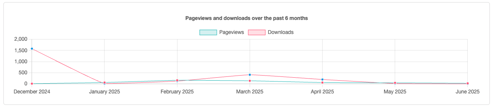
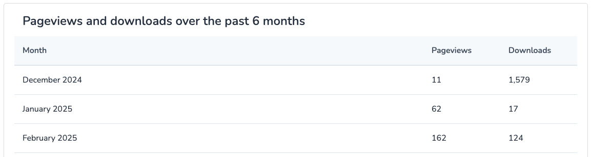
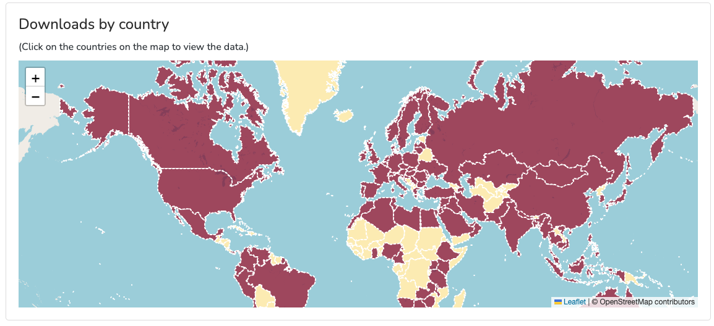
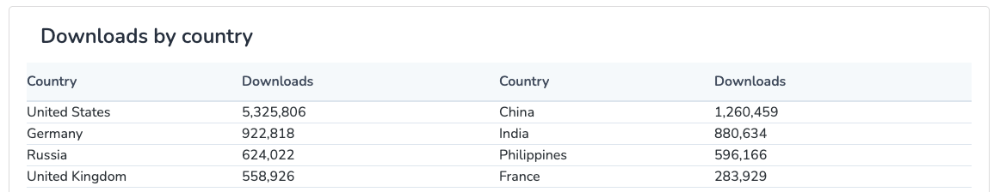

# 📊 Enhanced DSpace Statistics

Improved and extended statistics for DSpace 7.6, tailored to the needs of administrators, researchers, and stakeholders.

---

## Why Change? — Problem Statement

The default statistics pages in **DSpace 7** are limited in scope and usability:

- The tatistics pages offer data across different scopes, including site, community, collection, and individual items. However, their limited scope and plain text presentation reduce usability and effectiveness, failing to meet the diverse needs of administrators, researchers, and stakeholders.
- Community and Collection statistics pages offer only views of their home pages instead of stats of all items in community/collection.
- Lack of meaningful visualizations, filtering, and deeper insights.

This repository enhances the **Site**, **Community**, **Collection**, and **Item** statistics pages by introducing richer, more actionable data.

---

## What’s Improved — New Features

### Site / Community / Collection
- Total number of **pageviews** and **downloads** (all items)
- Monthly **pageviews/downloads** (last 6 months)
- Pageviews/downloads **by country**
- Pageviews/downloads **by city**
- **Top 10 most viewed/downloaded items**

### Item
- Total number of **pageviews** and **downloads**
- Monthly **pageviews/downloads** (last 6 months)
- Pageviews/downloads **by country**
- Pageviews/downloads **by city**

These enhancements allow stakeholders to track usage trends, discover geographic interest, and analyze item growth over time.

---

## How to Implement

1. **Clone this repository**
   Contains modified files and their paths in DSpace 7.6

2. **Integrate the files into your DSpace environment:**
   - Backend (Java): Replace or update relevant classes in your DSpace.
   - Frontend (Angular): Replace/update component files in `dspace-angular`.

3. **Use textual version or graphical version:**
   - Add parameter `useStatsCharts: true` to config.prod.yml for graphical version
   - By default the textual version is used.

4. **Rebuild your DSpace environment**
   Follow DSpace's standard rebuild procedures:
   ```bash
   # Backend
   cd dspace/
   mvn clean package

   # Frontend
   cd dspace-angular/
   yarn build:prod

5. **Restart your DSpace services**

---

## 🖼️ Screenshots







⸻

## 🧩 Compatibility
	•	✅ Tested with DSpace 7.6
	•	ℹ️ Not guaranteed to work on earlier versions

⸻

## 🤝 Contributing

Pull requests are welcome! If you have improvements, fixes, or ideas to expand metrics even further, feel free to contribute.

⸻

## 📄 License

MIT License. See LICENSE for details.
